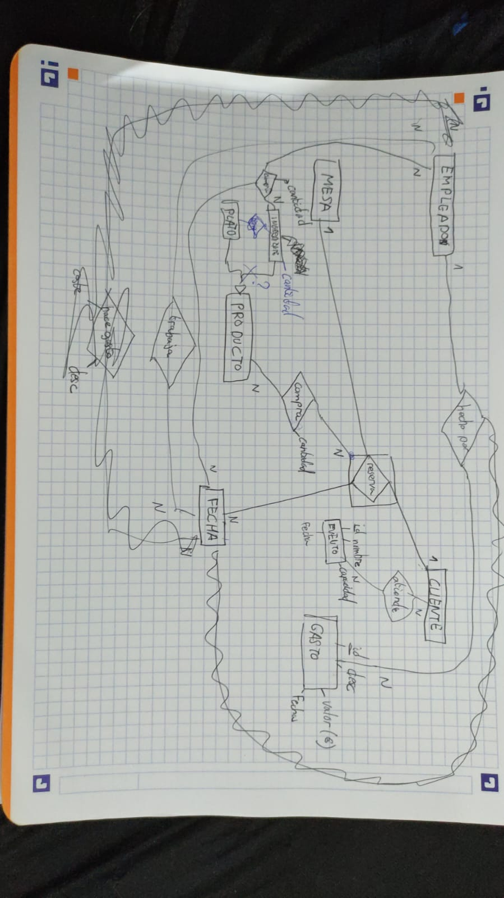
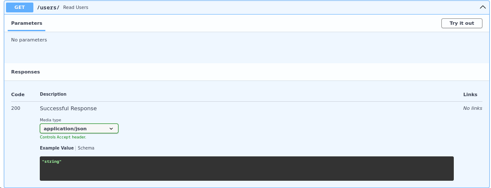

# sge_theBear_grupD
projecte the bear sge grup D
## Model Entitat-Relació

## Model Relacional

Cambios:  
Productos se cambia a menú, que tiene: id, primer, segon, postre, preu  
Gasto (no tiene relación): id, descripcio, preu  
Jornada: id_empleat, dia, mes, any, hora_inici, hora_final  
Reserva: id  
Evento: Se quita id empleado y cliente  
Compra (no tiene relación): id, hora, dia, mes, any, producto (string), cantidad, provedor (string), precio  

## Endpoints Reserva

## Endpoints Venta

