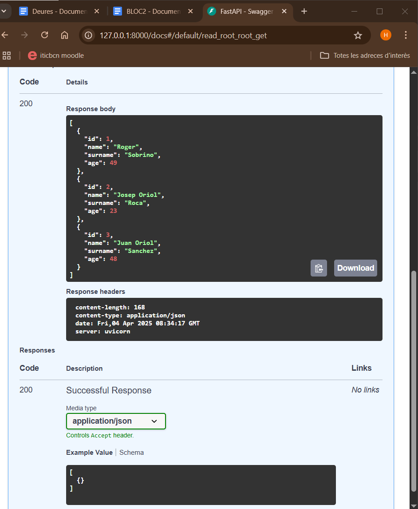

# sge_theBear_grupD
projecte the bear sge grup D

* Primeres passes amb FASTAPI 

El que hem fet en aquesta activitat és crear un endpoint els quals ens retorna els clients que tenim a la nostra base de dades. 

Amb fast api podem visualitzar els mètodes que hem creat (endpoints) amb la url/docs que ens retorna la següent informació.

Veiem qu el end point es de tipus get (demana informació a la base de dades) de color blau i en donar-li a *execute* s'executa la funció y ens mostra la informació del clients de la nostra base de dades. 

