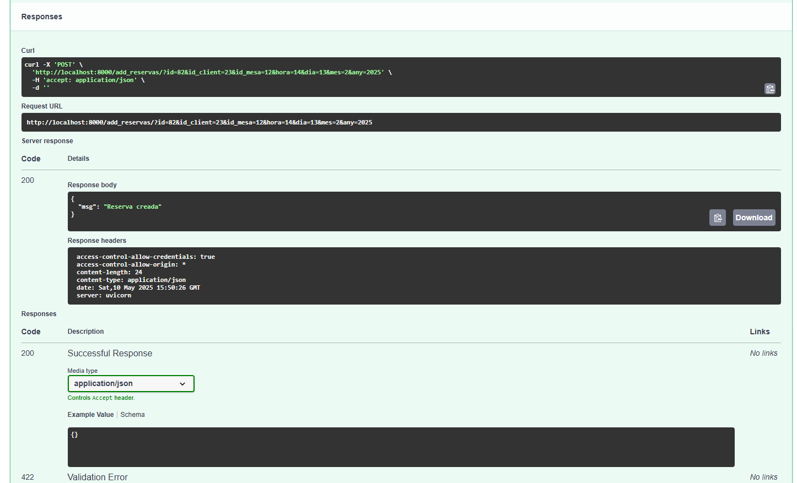

# sge_theBear_grupD
projecte the bear sge grup D
##
Model Entitat-Relació

## Model Relacional

Cambios:  
Productos se cambia a menú, que tiene: id, primer, segon, postre, preu  
Gasto (no tiene relación): id, descripcio, preu  
Jornada: id_empleat, dia, mes, any, hora_inici, hora_final  
Reserva: id  
Evento: Se quita id empleado y cliente  
Compra (no tiene relación): id, hora, dia, mes, any, producto (string), cantidad, provedor (string), precio  

## Endpoints Reserva
La clau primària de les reserves és l'id, i també tenen l'id del client que reserva, la taula que reserven i l'hora i la data.
### Llegir totes les reserves

### Llegir una reserva per id

### Crear una reserva introduint tots els camps

### Modificar una reserva per id

### Esborrar una reserva

## Endpoints Venda
Una venda té com a clau primària les claus foranes id reserva e id menú. Té com a atribut la quantitat de menús que es venen.

### Llegir totes les vendes

### Llegir una venda per l'id de la reserva i del menú

### Llegir totes les vendes d'una taula

Hem definit una venda com la quantitat d'un menú que es ven en una reserva. Aquest endpoint serveix per poder generar un tiquet,
 ja que ens ensenya tots els menús que s'han venut a una reserva.
### Afegir venda

### Modificar venda

### Esborrar venda

## módulos Empleat, Client y Event

## módulo Empleat

### Creamos un nuevo empleado, introduciendo en los campos la información necesaria.
### Tiene la id como clave primaria así como nombre completo, teléfono y cargo como datos.

### Revisamos que aparece cómo nuevo empleado por id

### Revisamos todos los empleados

### Actualizaremos un empleado por id

### Eliminaremos un empleado por id

## módulo Client

### Creamos un nuevo cliente, introduciendo en los campos la información necesaria.
### Tiene la id como clave primaria así como nombre completo, teléfono como datos.

 
### Revisamos que aparece el nuevo cliente por id

### Revisamos todos los clientes

### Actualizaremos un cliente por id

### Eliminaremos un cliente por id

## módulo Event

### Creamos un nuevo evento, introduciendo en los campos la información necesaria.
### Tiene la id como clave primaria así como día, hora, mes, año y descripción como datos.

### Revisamos que aparece como nuevo evento por id

### Revisamos todos los eventos

### Actualizaremos un evento por id

### Eliminaremos un evento por id

## Modulo Compra

### Creamos una nueva compra, con lo siguientes parametros id, nombre y precio

## Devuelve las compras por id

## Actualizamos una compra existent

ç

## Eliminamos una compra existente para la cual necesitmos un id del producto y el dia.

## Este get es diferente al otro este lo que hace es devolvernos todas las compras que esten almacenadas en la base de datos

## MODULO DE GASTOS

## Creamos un nuevo gasto 

## Ahora obtendremos los gastos de un empleado especifico en un dia

## Actulaizamos un gasto exisitente 

## Borramos un gasto especifico

## MODULO MENU

## Creamos un nuevo menu 

## Nos muestra un menu en especifico 

## En cambio aqui nos muestra todos los menus 

## Actualizar unn menu especifico

## Eliminar un menu especifico

